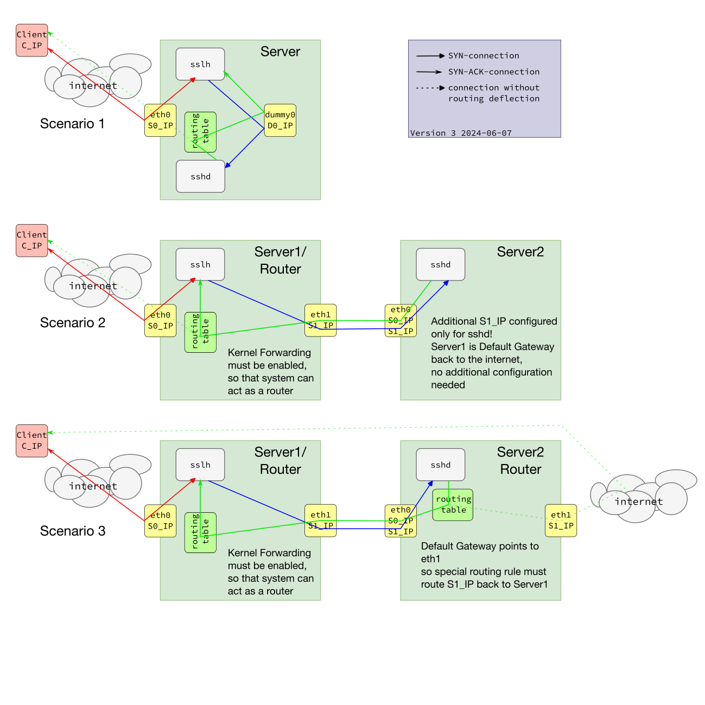

# Three Scenarios for the simple transparent proxy setup #



## Introduction ##
The first example is the configuration, which was described in the previous document. I omitted the loopback interface "lo" in those diagrams, trying not no overload the picture. 
The connections have two different endings, showing the direction of the opening connection (SYN flag) and the answer connection (SYN-ACK flags). This is important, as the traffic in the transparent proxy setup flows somewhat unexpected.

## Example 1 ##
The first example shows the setup, which is described in the [previous document](./simple_transparent_proxy.md). You see the Client connecting to sslh (red connection). When sslh accepts this connection, the SYN-ACK packet is send back to the client, which sends the first data packet(s) together with the ACK for the SYN-ACK. So the bidirectional tcp connection is fully open.
Sslh opens now the blue connection to sshd and needs for that elevation rights, as it uses the clients IP address as its own address for opening this connection. Now things are becoming complicated: Sshd send back the first packet with SYN-ACK flags (green line), addressed to the clients IP (dotted line). As already described, that would go wrong, so our routing trick makes this packet beeing deflected back to sslh, so this tcp connection is also opened. But we have here now an asymetric behaviour, that the read and write pathes of the tcp connection are going different routes.
The sslh process shuffles now all the bytes coming from sshd from the green line to the red line, vice versa for the packets from the client.

## Example 2 ##
In this example sshd is running on another server. No matter, if this is docker, kvm, virtualbox or another physical host, connected with an ethernet cable. Here we need no dummy interface, so we need another way, to configure our routing deflection.  The principle is the same: We need to force packets coming back from sshd going to sslh and not directly back to the client.
In this case its your decision, where those rules will be tied in, options are:

* the startscript of sslh
* the docker or kvm configuration
* the configuration of the outgoing interface

Its two lines you need:
```
ip rule add from SSHD_ADDRESS/32 table sslh
ip route add local 0.0.0.0/0 dev lo table sslh
```
On the sshd host, we need no additional rules, as all traffic is coming back to our sslh host, because this is in this setting the default gateway.  The only thing, we need to do: Assign a unique IP address only for sshd and all other services, you wish to hide behind sslh and host on this device.

There are two ways, how you can add multiple ip addresses to one device. The new _**ip addr add**_ supports multiple add statements to one and the same interface name. So you can just duplicate the interface stancas in the _**/etc/network/interfaces**_ configuration. The problem with this method is, that some older managment tools, like ifconfig are unable to show the additional addresses. So when you are used to some older tools, you may configure sub-interfaces like eth0:1.
However my recommendation is, migrate to new tools, get used to it, as old tools don't show you the whole configuration!

## Example 3 ##
This is now the extended version of the previous example. The target host has another path back to the client, as there is a default route to another interface. Now we need **TWO** routing deflections, one on the sslh host, like in scenario 2, and one on the sshd target host.
The routing setup on the target host looks like:
* Add an routing table name for the deflection table in _**/etc/iproute2/rt_tables**_
* Find a location, where you will hook the two routing rules in
```
ip rule add from SSHD_ADDRESS/32 table sslh_routeback
ip route add default via SERVER1_ETH1_IP dev eth0 table sslh_routeback

```
This is setting up a default route for all traffic, originating from the ip address sshd (or any other service) is using, back to the host, hosting sslh. On that host, those packets will be deflected again with the same rule from scenario 2.

Be aware, that scenario 3 can look very different and the picture above shows only one of those setups. Each configuration, where packets from the target system can find their way back, without beeing forcibly routed through the sslh hosting system, belongs into this category. This are e.g. virtual machines or containers, having interfaces in the same network, like the sslh hosting system. Even, when they look in some drawings embedded in their host, as soon, as they have network interfaces, allowing a direct connection to the client, it is scenario 3!

## Modifications ##
Now you can think about many modifications, but the tools will be the same, for all other thinkable scenarios. You must always make sure, that packets from foreign hosts, will find their way back to the sslh host. So if the chain consists of three or four servers, all need the deflection rules. 

## Important Finding On Routing ##
When I went ahead and wrote in my first drawings the warning, that the kernel in scenario 2 and 3 needs to have forwarding in place, I finally tested, that this is not true. **Both scenarios are working without kernel forwarding beeing activated!**
The background:  The deflecting routing table cames into the game, before the kernel has to made the decision, that packets with non local ip addresses in source and destination must be forwarded. After the routing rule deliveres the packet to sslh and sslh rewrites the source ip, the packet is treated as local, and can pass the system.
