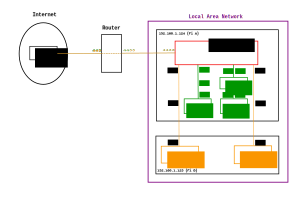

# Transparent proxy using packet marking

Before reading further, make sure you try to set up
transparent proxying using [IP routing](doc/simple_transparent_proxy.md).
It is conceptually easier to understand, cleaner, and more
portable.

Using this method is very tricky and
detail-dependant: depending on whether the target server and
sslh are on the same machine, different machines, or
different dockers, and tool versions, all seem to change the
required network configuration somewhat. If it doesn't work,
it's almost certain that the problem is not linked to `sslh`
but to the network setup that surrounds it. If in trouble,
it might be worth trying to set up the network rules
with a simpler server than `sslh`, such as
[`socat`](http://www.dest-unreach.org/socat/)


Users have tried to do at least the following:

  * `sslh` and the target servers run on the same host (see [below](#transparent-proxy-to-one-host))
  * `sslh` runs on a host, and the target servers run on LXC or dockers running on the same host. No known working setup.
  * `sslh` runs on a host, and the target servers run on different hosts on the same local network(see [below](#transparent-proxy-to-two-hosts))
  * `sslh` runs on a host, and the target servers run on a different host on a different network (there is a [usecase](https://github.com/yrutschle/sslh/issues/295) for this). No known working setup, and it's unclear it is possible.


## Transparent proxy to one host

### Linux

`sslh` needs extended rights to perform this: you'll need to
give it `CAP_NET_RAW` capabilities (see appropriate chapter)
or run it as root (but don't do that).

The firewalling tables also need to be adjusted as follows.
I don't think it is possible to have `httpd` and `sslh` both listen to 443 in
this scheme -- let me know if you manage that:

	# Set route_localnet = 1 on all interfaces so that ssl can use "localhost" as destination
	sysctl -w net.ipv4.conf.default.route_localnet=1
	sysctl -w net.ipv4.conf.all.route_localnet=1

	# DROP martian packets as they would have been if route_localnet was zero
	# Note: packets not leaving the server aren't affected by this, thus sslh will still work
	iptables -t raw -A PREROUTING ! -i lo -d 127.0.0.0/8 -j DROP
	iptables -t mangle -A POSTROUTING ! -o lo -s 127.0.0.0/8 -j DROP

	# Mark all connections made by ssl for special treatment (here sslh is run as user "sslh")
	iptables -t nat -A OUTPUT -m owner --uid-owner sslh -p tcp --tcp-flags FIN,SYN,RST,ACK SYN -j CONNMARK --set-xmark 0x01/0x0f

	# Outgoing packets that should go to sslh instead have to be rerouted, so mark them accordingly (copying over the connection mark)
	iptables -t mangle -A OUTPUT ! -o lo -p tcp -m connmark --mark 0x01/0x0f -j CONNMARK --restore-mark --mask 0x0f

	# Configure routing for those marked packets
	ip rule add fwmark 0x1 lookup 100
	ip route add local 0.0.0.0/0 dev lo table 100

Transparent proxying with IPv6 is similarly set up as follows:

	# Set route_localnet = 1 on all interfaces so that ssl can use "localhost" as destination
	# Not sure if this is needed for ipv6 though
	sysctl -w net.ipv4.conf.default.route_localnet=1
	sysctl -w net.ipv4.conf.all.route_localnet=1

	# DROP martian packets as they would have been if route_localnet was zero
	# Note: packets not leaving the server aren't affected by this, thus sslh will still work
	ip6tables -t raw -A PREROUTING ! -i lo -d ::1/128 -j DROP
	ip6tables -t mangle -A POSTROUTING ! -o lo -s ::1/128 -j DROP

	# Mark all connections made by ssl for special treatment (here sslh is run as user "sslh")
	ip6tables -t nat -A OUTPUT -m owner --uid-owner sslh -p tcp --tcp-flags FIN,SYN,RST,ACK SYN -j CONNMARK --set-xmark 0x01/0x0f

	# Outgoing packets that should go to sslh instead have to be rerouted, so mark them accordingly (copying over the connection mark)
	ip6tables -t mangle -A OUTPUT ! -o lo -p tcp -m connmark --mark 0x01/0x0f -j CONNMARK --restore-mark --mask 0x0f

	# Configure routing for those marked packets
	ip -6 rule add fwmark 0x1 lookup 100
	ip -6 route add local ::/0 dev lo table 100

Explanation:
To be able to use `localhost` as destination in your sslh config along with transparent proxying
you have to allow routing of loopback addresses as done above.
This is something you usually should not do (see [this stackoverflow post](https://serverfault.com/questions/656279/how-to-force-linux-to-accept-packet-with-loopback-ip/656484#656484))
The two `DROP` iptables rules emulate the behaviour of `route_localnet` set to off (with one small difference:
allowing the reroute-check to happen after the fwmark is set on packets destined for sslh).
See [this diagram](https://upload.wikimedia.org/wikipedia/commons/3/37/Netfilter-packet-flow.svg) for a good visualisation
showing how packets will traverse the iptables chains.

Note:
You have to run `sslh` as dedicated user (in this example the user is also named `sslh`), to not mess up with your normal networking.
These rules will allow you to connect directly to ssh on port
22 (or to any other service behind sslh) as well as through sslh on port 443.

Also remember that iptables configuration and ip routes and 
rules won't be necessarily persisted after you reboot. Make 
sure to save them properly. For example in CentOS7, you would 
do `iptables-save > /etc/sysconfig/iptables`, and add both 
`ip` commands to your `/etc/rc.local`.

### FreeBSD

Given you have no firewall defined yet, you can use the following configuration
to have ipfw properly redirect traffic back to sslh

	/etc/rc.conf
	firewall_enable="YES"
	firewall_type="open"
	firewall_logif="YES"
	firewall_coscripts="/etc/ipfw/sslh.rules"


/etc/ipfw/sslh.rules

	#! /bin/sh

	# ssl
	ipfw add 20000 fwd 192.0.2.1,443 log tcp from 192.0.2.1 8443 to any out
	ipfw add 20010 fwd 2001:db8::1,443 log tcp from 2001:db8::1 8443 to any out

	# ssh
	ipfw add 20100 fwd 192.0.2.1,443 log tcp from 192.0.2.1 8022 to any out
	ipfw add 20110 fwd 2001:db8::1,443 log tcp from 2001:db8::1 8022 to any out

	# xmpp
	ipfw add 20200 fwd 192.0.2.1,443 log tcp from 192.0.2.1 5222 to any out
	ipfw add 20210 fwd 2001:db8::1,443 log tcp from 2001:db8::1 5222 to any out

	# openvpn (running on other internal system)
	ipfw add 20300 fwd 192.0.2.1,443 log tcp from 198.51.100.7 1194 to any out
	ipfw add 20310 fwd 2001:db8::1,443 log tcp from 2001:db8:1::7 1194 to any out

General notes:


This will only work if `sslh` does not use any loopback
addresses (no `127.0.0.1` or `localhost`), you'll need to use
explicit IP addresses (or names):

	sslh --listen 192.168.0.1:443 --ssh 192.168.0.1:22 --tls 192.168.0.1:4443

This will not work:

	sslh --listen 192.168.0.1:443 --ssh 127.0.0.1:22 --tls 127.0.0.1:4443
    
Transparent proxying means the target server sees the real
origin address, so it means if the client connects using
IPv6, the server must also support IPv6. It is easy to
support both IPv4 and IPv6 by configuring the server
accordingly, and setting `sslh` to connect to a name that
resolves to both IPv4 and IPv6, e.g.:

        sslh --transparent --listen <extaddr>:443 --ssh insideaddr:22

        /etc/hosts:
        192.168.0.1  insideaddr
        201::::2     insideaddr

Upon incoming IPv6 connection, `sslh` will first try to
connect to the IPv4 address (which will fail), then connect
to the IPv6 address.


## Transparent Proxy to Two Hosts

Tutorial by Sean Warner.  19 June 2019 20:35

### Aim

* Show that `sslh` can transparently proxy requests from the internet to services on two separate hosts that are both on the same LAN.
* The IP address of the client initiating the request is what the destination should see… and not the IP address of the host that `sslh` is running on, which is what happens when `sslh` is not running in transparent mode.
* The solution here only works for my very specific use-case but hopefully others can adapt it to suits their needs.

### Overview of my Network

Two Raspberry Pis on my home LAN:
* Pi A: 192.168.1.124 – `sslh` (Port 4433), Apache2 web server for https (port 443), `stunnel` (port 4480) to decrypt ssh traffic and forward to SSH server (also on Pi A at Port 1022)
* Pi B: 192.168.1.123 - HTTP server (port 8000), SSH server (port 1022 on PiB).
* I send traffic from the internet to my router's external port 443 then use a port forward rule in my router to map that to internal port 4433 where sslh is listening.



### `sslh` build
 
`sslh` Version: sslh v1.19c-2-gf451cc8-dirty.

I compiled sslh from sources giving the binary pretty much all possible options such as Posix capabilities and systemd support.. here are the first few lines of the makefile:
 
```
# Configuration
 
VERSION=$(shell ./genver.sh -r)
ENABLE_REGEX=1         # Enable regex probes
USELIBCONFIG=1         # Use libconfig? (necessary to use configuration files)
USELIBPCRE=1           # Use libpcre? (needed for regex on musl)
USELIBWRAP=1           # Use libwrap?
USELIBCAP=1            # Use libcap?
USESYSTEMD=1           # Make use of systemd socket activation
COV_TEST=              # Perform test coverage?
PREFIX=/usr/local
BINDIR=$(PREFIX)/sbin
MANDIR=$(PREFIX)/share/man/man8
MAN=sslh.8.gz          # man page name
 
# End of configuration -- the rest should take care of
# itself
```
 
### systemd setup

Create an sslh systemd service file...
```
# nano /lib/systemd/system/sslh.service
```
 
Paste in this contents…
 
```
[Unit]
Description=SSL/SSH multiplexer
After=network.target
Documentation=man:sslh(8)
 
[Service]
#EnvironmentFile=/etc/default/sslh
#ExecStart=/usr/local/sbin/sslh $DAEMON_OPTS
ExecStart=/usr/local/sbin/sslh -F /etc/sslh/sslh.cfg
KillMode=process
 
[Install]
WantedBy=multi-user.target
```
 
Save it and then…
```
# systemctl daemon-reload
```
 
Start it again to test…
```
# systemctl start sslh
```
 
### Configure `sslh`

First stop `sslh` then open the config file and replace with below, save and start `sslh` again
```
# systemctl stop sslh
# nano /etc/sslh/sslh.cfg
# systemctl start sslh
```
 
```
verbose: true;
foreground: true;
inetd: false;
numeric: true;
transparent: true;
timeout: 2;
user: "sslh";
pidfile: "/var/run/sslh.pid";
chroot: "/var/empty";
 
# You must have a port forward rule in the router: external port 443 <-> internal port 4433
# Local ip address of PiA is: 192.168.1.124, sslh and stunnel4 are running on this Pi
# Local ip address of PiB is: 192.168.1.123, http server and ssh server on this Pi
listen:
(
{ host: "192.168.1.124"; port: "4433"; }
);
 
# sslh demultiplexes based on the Protocol and Hostname
protocols:
(
{ name: "tls"; sni_hostnames: [ "www.example.com" ]; host: "192.168.1.124"; port: "443"; log_level: 1; },
# This probe is for tls encrypted ssh. SSLH forwards it to stunnel on port 4480 which decrypts it and sends it to the ssh server on PiA port 1022
{ name: "tls"; sni_hostnames: [ "ssh.example.com" ]; host: "192.168.1.124"; port: "4480"; log_level: 1; },
{ name: "http"; host: "192.168.1.123"; port: "8000"; log_level: 1; },
{ name: "ssh"; host: "192.168.1.123"; port: "1022"; log_level: 1; }
);
```
 
### Configure `stunnel`

First stop `stunnel` then open the config file and replace with below, save and start `stunnel` again
```
# systemctl stop stunnel4
# nano /etc/stunnel/stunnel.conf
# systemctl start stunnel4
```
 
```
# Debugging stuff (may be useful for troubleshooting)
foreground = yes
#debug = 5 # this is the default
debug = 7
output = /var/log/stunnel4/stunnel.log
pid = /var/run/stunnel4/stunnel.pid
fips = no
 
cert = /etc/letsencrypt/live/example.com/fullchain.pem
key = /etc/letsencrypt/live/example.com/privkey.pem
 
[ssh]
accept = 192.168.1.124:4480
connect = 192.168.1.124:1022
TIMEOUTclose  = 0
```
 
### Configure iptables for Pi A

The `_add.sh` script creates the rules, the `_rm.sh` script removes the rules.
They will be lost if you reboot but there are ways to make them load again on start-up..
```
# nano /usr/local/sbin/piA_tproxy_add.sh
```
``` piA_tproxy_add.sh
iptables -t mangle -N SSLH
iptables -t mangle -A PREROUTING -p tcp -m socket --transparent -j SSLH
iptables -t mangle -A OUTPUT --protocol tcp --out-interface eth0 -m multiport --sport 443,4480 --jump SSLH
iptables -t mangle -A SSLH --jump MARK --set-mark 0x1
iptables -t mangle -A SSLH --jump ACCEPT
ip rule add fwmark 0x1 lookup 100
ip route add local 0.0.0.0/0 dev lo table 100
```
 
```
# nano /usr/local/sbin/piA_tproxy_rm.sh
```
``` piA_tproxy_rm.sh
iptables -t mangle -D PREROUTING -p tcp -m socket --transparent -j SSLH
iptables -t mangle -D OUTPUT --protocol tcp --out-interface eth0 -m multiport --sport 443,4480 --jump SSLH
iptables -t mangle -D SSLH --jump MARK --set-mark 0x1
iptables -t mangle -D SSLH --jump ACCEPT
iptables -t mangle -X SSLH
ip rule del fwmark 0x1 lookup 100
ip route del local 0.0.0.0/0 dev lo table 100
```
 
Make them executable..
```
# chmod +rx piA_tproxy_add.sh
# chmod +rx piA_tproxy_rm.sh
```
 
Now run the "add" script on Pi A!
```
# piA_tproxy_add.sh
# piA_tproxy_rm.sh
```
 
## Configure iptables for Pi B

```
# nano /usr/local/sbin/piB_tproxy_add.sh
```
``` piB_tproxy_add.sh
iptables -t mangle -N SSLHSSL
iptables -t mangle -A OUTPUT -o eth0 -p tcp -m multiport --sport 1022,8000 -j SSLHSSL
iptables -t mangle -A SSLHSSL --jump MARK --set-mark 0x1
iptables -t mangle -A SSLHSSL --jump ACCEPT
ip rule add fwmark 0x1 lookup 100
ip route add default via 192.168.1.124 table 100
ip route flush cache
```
 
```
# nano /usr/local/sbin/piB_tproxy_rm.sh
```
```
iptables -t mangle -D OUTPUT -o eth0 -p tcp -m multiport --sport 1022,8000 -j SSLHSSL
iptables -t mangle -D SSLHSSL --jump MARK --set-mark 0x1
iptables -t mangle -D SSLHSSL --jump ACCEPT
iptables -t mangle -X SSLHSSL
ip rule del fwmark 0x1 lookup 100
ip route del default via 192.168.1.124 table 100
ip route flush cache
```
 
Make them executable..
```
# chmod +rx piB_tproxy_add.sh
# chmod +rx piB_tproxy_rm.sh
```
 
Now run the "add" script on Pi B!
```
# piB_tproxy_add.sh
# piB_tproxy_rm.sh
```
 
### Testing

* Getting to sshd on PiA

I did this test using 4G from my phone (outside the LAN)

To simulate this I use `proxytunnel`. External port 443 is forwarded by my router to 4433. I need to arrive at `sslh` (port 4433) with ssh encrypted as TLS (hence I use the -e switch) and the `sni_hostname` set to ssh.example.com so that `sslh` will demultiplex to `stunnel` (port 4480) which will decrypt and forward to ssh server on PiA… see `sslh.cfg` and `stunnel.conf`.

The first IP:port is just a free HTTPS proxy I found on https://free-proxy-list.net
I execute this command from a terminal window..
 
```
# proxytunnel -v -e -C root.pem -p 78.141.192.198:8080 -d ssh.example.com:443
```
* Getting to sshd on PiB

I did this test using 4G from my phone (outside the LAN)

My smartphone telecom provider blocks ssh over port 443 so I need to use `proxytunnel` to encrypt.

Use the Proxytunnel `-X` switch to encrypt from local proxy to destination only so by the time we get to the destination it is unencrypted and `sslh` will see the ssh protocol and demultiplex to PiB as per `sslh.cfg`.
 
```
# proxytunnel -v -X -C root.pem -p 78.141.192.198:8080 -d ssh.example.com:443
```

Now when you test it all look at the output in daemon.log like this:
```
# grep -i 'ssl' /var/log/daemon.log
```
You should see that the IP address and port from the “connection from” and “forwarded from” fields are the same.

Special thanks and appreciation to Michael Yelsukov without whom I would never have got this working.

Any feedback or corrections very welcome!
